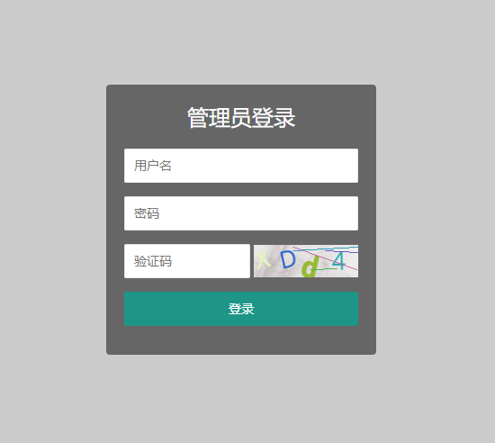
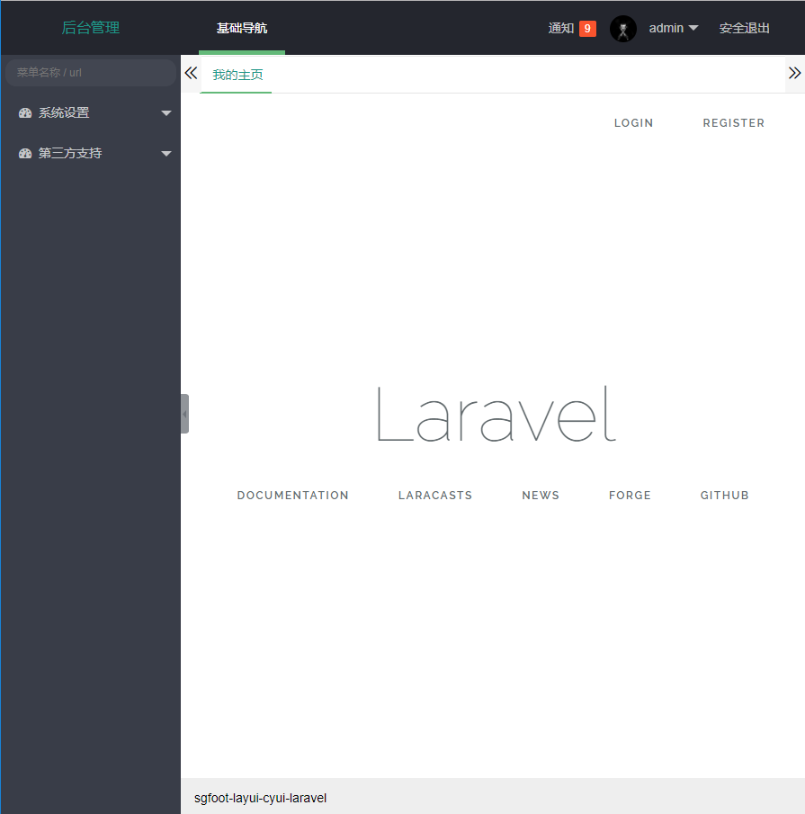

## 安装步骤
+ composer update
+ php artisan key:generate
+ php artisan migrate
+ php artisan serve

## 基础功能
* 登陆
* 注册
* 修改密码

## 效果

## 感谢
* laravel 5.3 [https://d.laravel-china.org/docs/5.3](https://d.laravel-china.org/docs/5.3)
* layui 2.2.5[http://www.layui.com/](http://www.layui.com/)
* cy-ui [http://www.cymall.xin:8084/](http://www.cymall.xin:8084/)
